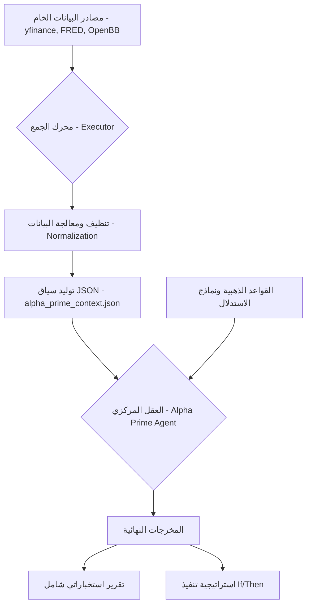

# 🏛️ بنية النظام وتدفق البيانات (System Architecture & Data Flow)

يعمل نظام **Alpha Prime** كوكيل استخبارات مالية من المستوى الرفيع، حيث يعالج البيانات عبر **14 طبقة** متكاملة لضمان دقة التحليل والتنفيذ.

---

## 1. الطبقات الاستخباراتية الـ 14 (The 14 Intelligence Layers)

تم تصميم النظام ليعمل بعمق يتجاوز التحليل الفني التقليدي، مقسماً البيانات إلى الطبقات التالية:

| الطبقة | النوع | الوصف |
|:---|:---|:---|
| **1** | **Price Action** | تحليل الشموع، المستويات التاريخية، والزخم (Momentum). |
| **2** | **AMT (Auction Theory)** | مناطق القيمة (VAH/VAL)، نقطة التحكم (POC)، وحالات التوازن. |
| **3** | **Macro Indicators** | مؤشرات FRED الحقيقية (CPI, M2, Unemployment, Fed Funds Rate). |
| **4** | **Intermarket Ratios** | النسب القيادية (Copper/Gold, US10Y/US02Y, HYG/TLT). |
| **5** | **Market Regimes** | تصنيف النظام الحالي (Goldilocks, Stagflation, Recession, Reflation). |
| **6** | **Smart Money** | تتبع تدفقات المؤسسات، تداولات "الداخلين" (Insiders)، وأعضاء الكونجرس. |
| **7** | **Sentiment Analysis** | تحليل الأخبار والمشاعر عبر نماذج FinBERT و DeepEar. |
| **8** | **Fundamentals** | أكثر من 150 مؤشر مالي (P/E, ROE, Debt/Equity) عبر FinanceToolkit. |
| **9** | **Alternative Data** | مؤشرات الشحن واللوجستيات (BDI/BDRY) والنشاط الاقتصادي المادي. |
| **10** | **Dynamic Correlations** | كشف القيادة الزمنية عبر Granger Causality و Transfer Entropy. |
| **11** | **Volatility & Credit** | مراقبة مؤشرات الخوف (VIX) والتقلب في السندات (MOVE). |
| **12** | **Neural Predictions** | التنبؤات السعرية قصيرة المدى باستخدام نماذج Kronos. |
| **13** | **Signal Evolution** | تتبع تطور "منطق" الإشارة (هل تزداد قوة أم تضعف؟). |
| **14** | **Risk & Conviction** | حساب درجة اليقين (Conviction Score) ونقاط الابطال (Invalidation). |

---

## 2. تدفق البيانات (Data Flow)

يمر مسار البيانات في Alpha Prime بخمس مراحل رئيسية لضمان تحويل الأرقام الخام إلى قرارات استراتيجية:

---

## 3. مراحل التحليل (Analysis Stages)

1.  **المرحلة الاستخراجية (Extraction):** سحب البيانات من أكثر من 10 مصادر مختلفة في وقت واحد عبر المهارات (Skills).
2.  **المرحلة السياقية (Contextualization):** تحويل البيانات الرقمية إلى معانٍ اقتصادية (مثلاً: 2s10s < 0 ليس مجرد رقم، بل هو "Inverted Yield Curve" يعني ركود محتمل).
3.  **مرحلة التوافق (Confluence Search):** البحث عن تقاطع الإشارات بين الطبقات. (مثلاً: السعر عند VAL + مشاعر إيجابية + تزايد سيولة M2).
4.  **مرحلة الاستدلال (Logical Inference):** تطبيق "القواعد الذهبية لعام 2026" على السياق المجمع.
5.  **مرحلة الصياغة (Synthesis):** دمج التحليلات في تقرير بشري مفهوم متبوعاً بأوامر برمجية دقيقة.

---

## 4. المخرجات (Outputs)

يصدر النظام مخرجات مزدوجة تلبي احتياجات المستثمر والمضارب الآلي:

### أ. التقرير الاستخباراتي (Strategic Intel):
- تحليل نظام السوق الكلي.
- خريطة السيولة ومناطق الطلب/العرض.
- تقييم المخاطر الجيوسياسية والهيكلية.

### ب. استراتيجية التنفيذ (Execution Strategy):
- **المنطق البرمجي:** أوامر `If Price < X and Indicator Y > Z then Long`.
- **درجة اليقين:** تقييم من 1-10 لمدى قوة الفرصة بناءً على توافق الطبقات.
- **إدارة المخاطر:** تحديد دقيق للهدف (TP) ووقف الخسارة (SL) بناءً على مستويات AMT.

### ج. التنبؤات العصبية (Neural Outputs):
- مسارات سعرية متوقعة للفترات القادمة بناءً على أنماط الذاكرة التاريخية.
