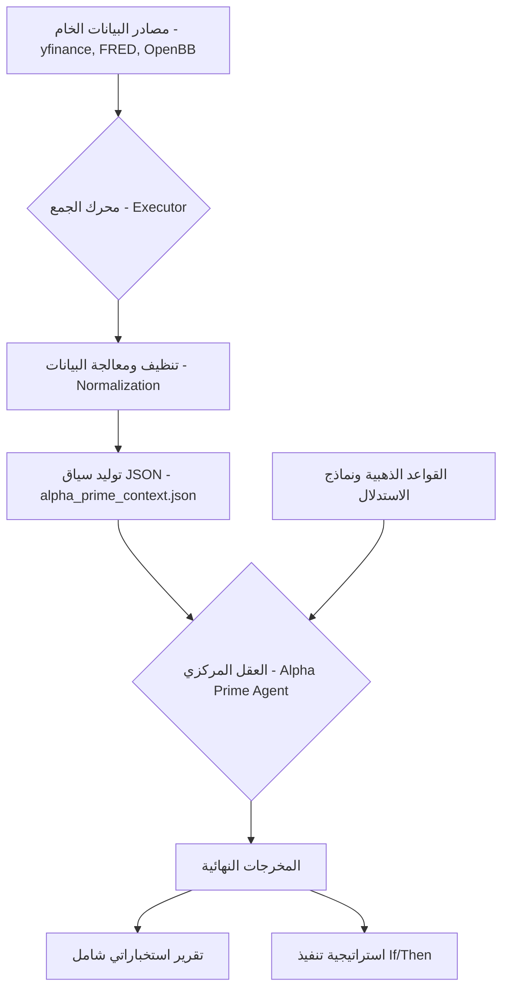

# 🏛️ بنية النظام وتدفق البيانات (System Architecture & Data Flow)

يعمل نظام **Alpha Prime** كوكيل استخبارات مالية من المستوى الرفيع، حيث يعالج البيانات عبر **14 طبقة استخباراتية** يتم دمجها في **9 أبعاد استراتيجية** (النموذج التساعي الشامل) لضمان دقة التحليل الاستثماري للذهب والأصول الكبرى.

---

## 1. الطبقات الاستخباراتية الـ 14 (The 14 Intelligence Layers)

تم تصميم النظام ليعمل بعمق مؤسساتي، مقسماً البيانات إلى الطبقات التالية:

| الطبقة | النوع | الوصف |
|:---|:---|:---|
| **1** | **Price Action** | تحليل الشموع، المستويات التاريخية، والزخم (Momentum). |
| **2** | **AMT (Auction Theory)** | مناطق القيمة (VAH/VAL)، نقطة التحكم (POC)، وحالات التوازن (TPO/Volume). |
| **3** | **Macro Indicators** | مؤشرات FRED الحقيقية (CPI, M2, Real Yields, Fed Funds). |
| **4** | **Intermarket Ratios** | النسب القيادية (Copper/Gold, Gold/Silver, Yield Curve Spread). |
| **5** | **Market Regimes** | تصنيف النظام الحالي (Stagflation, Recession, Reflation, Goldilocks). |
| **6** | **Smart Money (OSINT)** | تتبع تداولات أعضاء الكونجرس، إفصاحات 13F (وارن بافيت)، والـ Dark Pools. |
| **7** | **Sentiment Analysis** | تحليل الأخبار والمشاعر عبر نماذج FinBERT و DeepEar. |
| **8** | **Fundamentals** | تحليل DuPont و Piotroski F-Score لشركات التعدين والأسهم الكبرى. |
| **9** | **Options Dynamics** | تحليل Gamma Exposure (GEX)، والتحوط (Hedging) من صناع السوق. |
| **10** | **Dynamic Correlations** | كشف القيادة الزمنية والارتباطات المتغيرة بين السندات والذهب والأسهم. |
| **11** | **Volatility & Credit** | مراقبة مؤشرات الخوف (VIX) وتقلب السندات (MOVE). |
| **12** | **Neural Predictions** | التنبؤات السعرية قصيرة المدى باستخدام نماذج Kronos. |
| **13** | **Institutional Logic** | تتبع تحركات اللوبيات (مثل AIPAC) وتأثير ميزانيات التسليح والجيوسياسة. |
| **14** | **Risk & Metrics** | حساب نماذج EWMA للتقلب، القيمة المعرضة للخطر (VaR)، ونسب بيتا. |

---

## 2. النموذج التساعي الشامل (The Nonary Strategic Model)

يقوم العقل المركزي بدمج الطبقات الـ 14 في 9 أبعاد استراتيجية لتقديم التقرير النهائي:

1.  **السياق الكلي وتدفق السيولة:** دمج بيانات FRED مع تحليل المشاعر المتقدم لتصنيف الأحداث (مفاجئة، محتملة، غير محتملة).
2.  **هيكل السوق وحالة المزاد:** تشخيص "نوع اللعبة" (توازن vs اكتشاف السعر) عبر إطارات زمنية متعددة (Daily, Weekly, Monthly).
3.  **هيكل السيولة والفوليوم بروفايل:** تحديد أشكال البروفايل (P, b, D) ومناطق الجذب (HVN) والرفض (LVN).
4.  **التنفيذ والتحقق اللحظي:** استخدام Order Flow لكشف الامتصاص (Absorption) والفقاعات العدوانية.
5.  **إدارة المخاطر والمقاييس الكمية:** استخدام VaR و EWMA لضمان نسبة (Risk:Reward) غير متماثلة.
6.  **التحليل التقاطعي للأسواق:** ربط الذهب بالدولار، الفضة، السندات، والأسهم عبر النماذج الهيكلية.
7.  **التحليل الأساسي وهيكلة الشركات:** تطبيق DuPont و Piotroski على شركات التعدين وكشف فرص المراجحة (Arbitrage).
8.  **التوليف الاستراتيجي:** بناء سيناريوهات If/Then نهائية بناءً على تجميع كافة الأبعاد.
9.  **تتبع الأموال الذكية والجيوسياسة:** مراقبة الأوبشن (GEX)، تداولات الكونجرس، وتحركات اللوبيات والسياسة الخارجية.

---

## 3. تدفق البيانات (Data Flow)

يمر مسار البيانات في Alpha Prime بخمس مراحل رئيسية لضمان تحويل الأرقام الخام إلى قرارات استراتيجية:

```mermaid
graph TD
    A[مصادر البيانات الخام - yfinance, FRED, OpenBB] --> B{محرك الجمع - Executor}
    B --> C[تنظيف ومعالجة البيانات - Normalization]
    C --> D[توليد سياق JSON - alpha_prime_context.json]
    D --> E{العقل المركزي - Alpha Prime Agent}
    F[القواعد الذهبية ونماذج الاستدلال] --> E
    E --> G[المخرجات النهائية]
    G --> H[تقرير استخباراتي شامل]
    G --> I[استراتيجية تنفيذ If/Then]
```

---

## 3. مراحل التحليل (Analysis Stages)

1.  **المرحلة الاستخراجية (Extraction):** سحب البيانات من أكثر من 10 مصادر مختلفة في وقت واحد عبر المهارات (Skills).
2.  **المرحلة السياقية (Contextualization):** تحويل البيانات الرقمية إلى معانٍ اقتصادية (مثلاً: 2s10s < 0 ليس مجرد رقم، بل هو "Inverted Yield Curve" يعني ركود محتمل).
3.  **مرحلة التوافق (Confluence Search):** البحث عن تقاطع الإشارات بين الطبقات. (مثلاً: السعر عند VAL + مشاعر إيجابية + تزايد سيولة M2).
4.  **مرحلة الاستدلال (Logical Inference):** تطبيق "القواعد الذهبية لعام 2026" على السياق المجمع.
5.  **مرحلة الصياغة (Synthesis):** دمج التحليلات في تقرير بشري مفهوم متبوعاً بأوامر برمجية دقيقة.

---

## 4. المخرجات (Outputs)

يصدر النظام مخرجات مزدوجة تلبي احتياجات المستثمر والمضارب الآلي:

### أ. التقرير الاستخباراتي (Strategic Intel):
- تحليل نظام السوق الكلي.
- خريطة السيولة ومناطق الطلب/العرض.
- تقييم المخاطر الجيوسياسية والهيكلية.

### ب. استراتيجية التنفيذ (Execution Strategy):
- **المنطق البرمجي:** أوامر `If Price < X and Indicator Y > Z then Long`.
- **درجة اليقين:** تقييم من 1-10 لمدى قوة الفرصة بناءً على توافق الطبقات.
- **إدارة المخاطر:** تحديد دقيق للهدف (TP) ووقف الخسارة (SL) بناءً على مستويات AMT.

### ج. التنبؤات العصبية (Neural Outputs):
- مسارات سعرية متوقعة للفترات القادمة بناءً على أنماط الذاكرة التاريخية.
